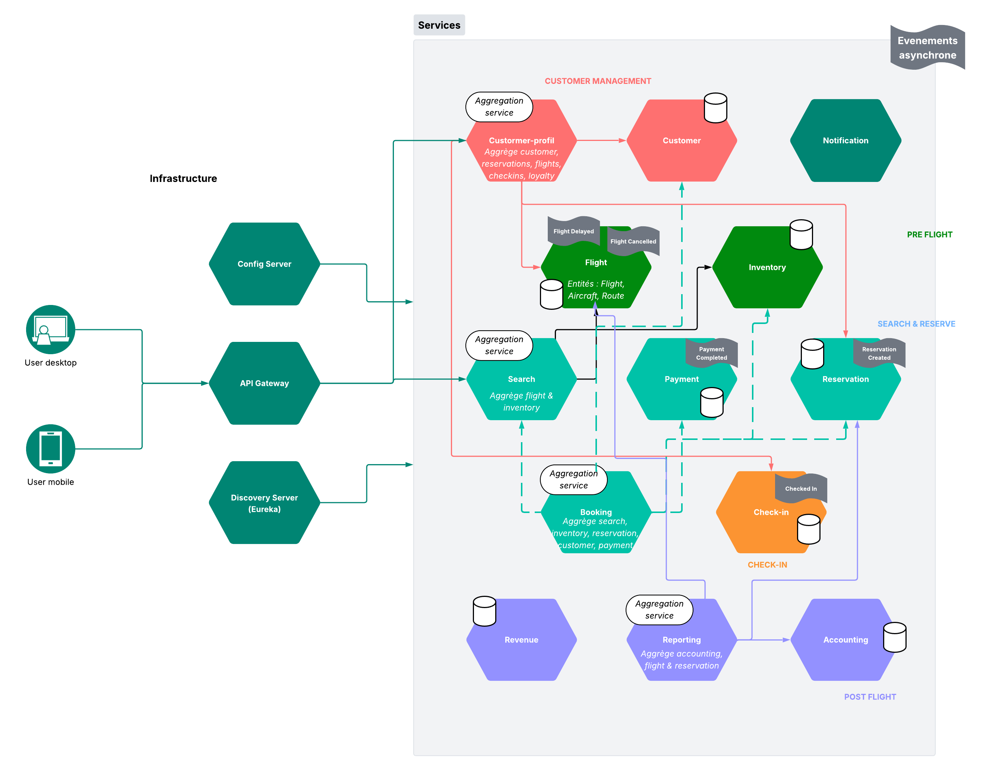

# Flight-System

## Architecture générale

Voici le schéma global de l’architecture :

## Bases de données

* Chaque micro-service persiste ses données dans une base **H2** embarquée (configuration `spring.datasource.url=jdbc:h2:mem:<serviceName>`).
* Les agrégateurs (`search-service`, `customer-profile-service`, `booking-service`, `reporting-service`) et l’infra n’utilisent pas de persistance.

## Prérequis et démarrage

1. Java 17+
2. Maven 3.6+ ou Gradle

**Note :** Ce projet est encore au tout début de son développement et ce README est en cours d’écriture